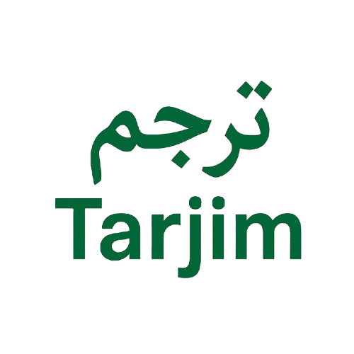
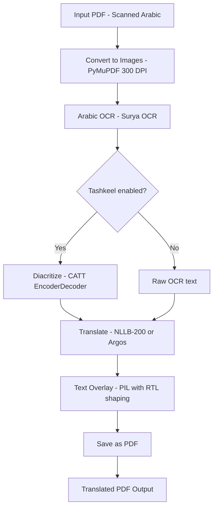

<div align="center">
  
</div>

# Tarjim: PDF Arabic OCR & Translator

End-to-end pipeline to **extract Arabic text from scanned PDF**, **diacritize it**, **translate it**, and **generate a new translated PDF** — fully offline using open-source tools.

Built for translating Arabic Islamic scholarly texts (kitab, hadith, tafsir, fiqh) to English and Indonesian, but supports 200 languages via NLLB-200.

---

## Overview

Tarjim automates the process of handling Arabic documents by integrating:

1. **PDF rendering** — PyMuPDF converts PDF pages to high-resolution images
2. **Arabic OCR** — Surya OCR detects and recognizes Arabic text with bounding boxes
3. **Tashkeel (optional)** — CATT restores harakat (short vowel marks) to undiacritized kitab text before translation, improving accuracy
4. **Offline translation** — NLLB-200 1.3B via CTranslate2 INT8 provides direct translation across 200 languages with no pivot needed; Argos Translate available as a lightweight fallback
5. **Text overlay** — Translated (and optionally diacritized) text replaces original Arabic on the PDF with proper font sizing and word-wrapping
6. **PDF generation** — Modified pages are saved as a new translated PDF

Designed for researchers, students, and anyone who needs an **offline, private, and flexible** document translation pipeline.

---

## Features

- Extract text from scanned or non-searchable Arabic PDFs (OCR via Surya)
- **Tashkeel**: restore Arabic harakat (حركات) before translation using CATT — 2024 SOTA, trained on 75M words from 97 classical Shamela books
- Translate to **200 languages** directly using NLLB-200 (no English pivot needed for ar→id)
- Lightweight fallback: Argos Translate for CPU-only or low-memory setups
- Two overlay modes: **replace** (overlay on original) or **clean** (white background)
- Optional **bilingual output**: show diacritized Arabic + translation stacked in the PDF
- Fully offline — no API keys, no internet required after first-run download
- Modular Python code (OCR / tashkeel / translation / overlay / PDF I/O separated)
- Web UI via FastAPI for browser-based usage
- CLI for batch/scripted processing

---

## Pipeline Architecture



## Tech Stack

| Component | Library | Notes |
|-----------|---------|-------|
| PDF handling | PyMuPDF | Read/write PDF, render pages to images |
| OCR | Surya OCR 0.17.x | Arabic text detection + recognition |
| Tashkeel | CATT (catt-tashkeel) | 2024 SOTA harakat restoration for classical Arabic |
| Translation (primary) | NLLB-200 1.3B via CTranslate2 INT8 | 200 languages, direct pairs, ~2.8 GB VRAM |
| Translation (fallback) | Argos Translate | Lightweight, CPU-friendly, lower quality |
| Arabic text rendering | arabic-reshaper + python-bidi | Correct RTL shaping for PIL overlay |
| Image processing | Pillow, OpenCV | Image manipulation, text overlay |
| Web API | FastAPI + Uvicorn | Browser-based upload/translate UI |
| Progress | tqdm | Progress bars for CLI |

---

## Requirements

- Python 3.10+
- **GPU recommended**: RTX 3050 6GB or better (NLLB-200 uses ~2.8 GB VRAM + ~2.5 GB for Surya OCR)
- CPU-only mode works but is significantly slower
- Windows, Linux, or macOS

> **Note on `transformers` version**: surya-ocr 0.17.x requires `transformers<5.0.0`. This is pinned in `requirements.txt`. Do not upgrade transformers to 5.x.

---

## Installation

```bash
# Clone the repo
git clone https://github.com/scrowten/tarjim.git
cd tarjim

# Create environment
python -m venv venv
source venv/bin/activate  # or venv\Scripts\activate (Windows)

# Install dependencies
pip install -r requirements.txt
```

### First-run downloads

On first use, the following models are downloaded automatically and cached locally:

| Model | Size | What for |
|-------|------|----------|
| Surya OCR (text_recognition) | ~300 MB | Arabic text recognition |
| Surya OCR (text_detection) | ~73 MB | Text region detection |
| NLLB-200 CT2-INT8 | ~2.6 GB | Translation (primary) |
| NLLB-200 tokenizer | ~600 MB | Tokenizer for NLLB |
| CATT tashkeel | ~86 MB | Arabic diacritization (if enabled) |

After the first run, everything works fully offline.

### Arabic font for tashkeel display

To display tashkeel in the PDF output (`--show-tashkeel`), place an Arabic-capable font at `fonts/amiri-regular.ttf`. The Amiri font is recommended (OFL license):

```bash
# Download from https://github.com/aliftype/amiri/releases
# Place at: fonts/amiri-regular.ttf
```

---

## Usage

### CLI

```bash
# Arabic to English (NLLB-200, default)
python -m src.cli -i kitab.pdf -o kitab_en.pdf --lang en

# Arabic to Indonesian — direct, no pivot (NLLB-200)
python -m src.cli -i kitab.pdf -o kitab_id.pdf --lang id

# Enable tashkeel for better translation of undiacritized kitab text
python -m src.cli -i kitab.pdf -o kitab_en.pdf --lang en --tashkeel

# Show diacritized Arabic + translation stacked in output PDF
python -m src.cli -i kitab.pdf -o kitab_en.pdf --lang en --tashkeel --show-tashkeel

# Use Argos Translate as lightweight fallback (no GPU required)
python -m src.cli -i kitab.pdf -o kitab_en.pdf --lang en --translator argos

# Clean mode (white background, translated text only)
python -m src.cli -i kitab.pdf -o kitab_en.pdf --overlay-mode clean

# Verbose logging
python -m src.cli -i kitab.pdf -o kitab_id.pdf --lang id --verbose
```

### CLI Options

| Option | Default | Description |
|--------|---------|-------------|
| `--input`, `-i` | (required) | Path to input Arabic PDF |
| `--output`, `-o` | (required) | Path to save translated PDF |
| `--lang`, `-l` | `en` | Target language code |
| `--source-lang` | `ar` | Source language code |
| `--translator` | `nllb` | `nllb` (high quality) or `argos` (lightweight) |
| `--tashkeel` | off | Diacritize Arabic before translation (CATT) |
| `--show-tashkeel` | off | Show diacritized Arabic in output PDF |
| `--dpi` | `300` | Rendering DPI |
| `--overlay-mode` | `replace` | `replace` or `clean` |
| `--font` | (auto) | Path to .ttf font file |
| `--verbose`, `-v` | off | Enable debug logging |

### Web API

```bash
# Start the web server
uvicorn src.api:app --host 0.0.0.0 --port 8000

# Open http://localhost:8000 in your browser
```

The web UI lets you upload a PDF, choose translator (NLLB-200 or Argos), target language, overlay mode, and tashkeel options, then download the translated PDF.

### Docker

```bash
docker build -t tarjim .
docker run -p 8000:8000 tarjim
```

### Python API

```python
from src.core.pdf_handler import process_pdf

# Arabic to English (NLLB-200, default)
process_pdf(
    input_path="kitab.pdf",
    output_path="kitab_en.pdf",
    target_lang="en",
    overlay_mode="replace",
)

# Arabic to Indonesian (NLLB-200, direct — no English pivot)
process_pdf(
    input_path="kitab.pdf",
    output_path="kitab_id.pdf",
    target_lang="id",
)

# Best quality: tashkeel + NLLB
process_pdf(
    input_path="kitab.pdf",
    output_path="kitab_en.pdf",
    target_lang="en",
    tashkeel=True,           # diacritize Arabic before translation
    show_tashkeel=False,     # set True to show harakat in PDF
)

# Lightweight: Argos Translate fallback (CPU, no ~3 GB download)
process_pdf(
    input_path="kitab.pdf",
    output_path="kitab_en.pdf",
    target_lang="en",
    translator="argos",
)
```

---

## Translation Backends

### NLLB-200 1.3B (default, `--translator nllb`)

Meta's No Language Left Behind model, quantized to INT8 via CTranslate2.

| Property | Value |
|----------|-------|
| Parameters | 1.3B |
| Download size | ~3.2 GB (one-time) |
| VRAM usage | ~2.8 GB (int8_float16) |
| Languages | 200+ |
| ar→id | Direct (no pivot) |
| Quality vs Argos | ~3–5× better |
| License | CC-BY-NC 4.0 |

All language pairs are **direct** — NLLB-200 translates Arabic → any target in one pass.

### Argos Translate (fallback, `--translator argos`)

Small OpenNMT-based models (~100M params). Useful for CPU-only environments or when the NLLB download is impractical.

| Property | Value |
|----------|-------|
| Parameters | ~74–100M |
| Download size | ~100–200 MB per language pair |
| VRAM usage | <0.5 GB |
| ar→id | Via English pivot (ar→en→id) |
| Quality | Lower than NLLB |
| License | MIT |

---

## Tashkeel (Arabic Diacritization)

Most classical Arabic kitab are printed without harakat (short vowel marks). This causes ambiguity that hurts translation quality. The `--tashkeel` flag uses **CATT** (Contextual Arabic Tashkeel Transformer) to restore harakat before translation.

**CATT details:**
- 2024 SOTA for Arabic diacritization
- Trained on **75M words** from **97 classical books** in the Shamela Digital Library (Tashkeela corpus)
- Specifically suited for classical Islamic Arabic (Quran, hadith, fiqh, tafsir)
- ~86 MB ONNX model, runs on CPU

**Modes:**

| Flag | Behavior |
|------|----------|
| (none) | No diacritization. OCR output goes directly to translator. |
| `--tashkeel` | Diacritize silently before translation. Better translation quality. |
| `--tashkeel --show-tashkeel` | Diacritize + render diacritized Arabic in output PDF above translation. |

---

## How It Works

**Step 1 — PDF to Images**: Each PDF page is rendered at 300 DPI using PyMuPDF, producing high-resolution PIL Images.

**Step 2 — OCR with Surya**: Surya OCR detects text regions and recognizes Arabic text, returning text lines with precise bounding boxes.

**Step 3 — Tashkeel (optional)**: CATT EncoderDecoder restores harakat to each detected Arabic text line. The diacritized text feeds into the translator instead of raw OCR output.

**Step 4 — Translation**: Each text line is translated using the selected backend:
- **NLLB-200**: Direct translation to any of 200 languages. Uses CTranslate2 INT8 on GPU (auto-detected).
- **Argos Translate**: Direct ar→en, or auto-pivot ar→en→target for other languages.

**Step 5 — Text Overlay**: In `replace` mode, each original text region is covered with a white rectangle, then the translated text is drawn with dynamically-sized fonts and word-wrapping. If `show_tashkeel` is enabled, the diacritized Arabic is also rendered above the translation (RTL, Amiri font). In `clean` mode, a fresh white page is used.

**Step 6 — Save PDF**: All modified page images are combined into a new multi-page PDF.

---

## Folder Structure

```
tarjim/
├── README.md
├── requirements.txt
├── Dockerfile
├── src/
│   ├── cli.py                      # CLI entry point
│   ├── api.py                      # FastAPI web server
│   └── core/
│       ├── pdf_handler.py          # Pipeline orchestrator + PDF I/O
│       ├── ocr_surya.py            # Surya OCR wrapper (with transformers 4.x compat patch)
│       ├── tashkeel.py             # CATT tashkeel wrapper
│       ├── translator_nllb.py      # NLLB-200 translator (CTranslate2 INT8)
│       ├── translator_argos.py     # Argos Translate wrapper (fallback)
│       └── utils.py                # Overlay, font, RTL drawing helpers
├── static/
│   ├── index.html                  # Web UI
│   └── styles.css
├── fonts/
│   ├── times.ttf                   # Bundled Latin font
│   └── amiri-regular.ttf           # (optional) Arabic font for tashkeel display
├── examples/
│   └── ...                         # Sample Arabic kitab PDFs
├── tests/
│   └── ...
└── docs/
    └── logo.png
```

---

## Performance

| Hardware | Surya OCR | NLLB Translation | Per page |
|----------|-----------|-----------------|----------|
| RTX 3050 6GB | ~2.5 GB VRAM | ~2.8 GB VRAM | ~5–15 s |
| CPU only | Slow | ~30–60 s/line | Minutes |

**VRAM budget (RTX 3050 6GB):**
- Surya OCR: ~2.5 GB
- NLLB-200 CT2-INT8: ~2.8 GB
- CATT tashkeel: ~0.1 GB (CPU, ONNX)
- Total: ~5.3 GB — fits within 6 GB when loaded sequentially

**Tips:**
- Higher DPI (400) improves OCR accuracy on small print
- `--tashkeel` adds ~2–5 s per page but meaningfully improves translation of undiacritized text
- First run is slow (model downloads); subsequent runs are fully offline

---

## Planned

- Phase 2: I'rab (Arabic morphosyntactic parsing) for language learners
- Phase 3: Desktop GUI (pywebview wrapper)
- Phase 4: Local server + Cloudflare Tunnel for remote access

---

## Author

Risky Agung Dwi Putranto

## License

MIT License — free to use, modify, and share.

## Acknowledgements

- [Surya OCR](https://github.com/VikParuchuri/surya) — State-of-the-art document OCR
- [CATT Tashkeel](https://github.com/ARBML/CATT) — Arabic diacritization (2024 SOTA)
- [NLLB-200](https://ai.meta.com/research/no-language-left-behind/) — Meta's 200-language translation model
- [CTranslate2](https://github.com/OpenNMT/CTranslate2) — Fast INT8 inference for seq2seq models
- [Argos Translate](https://github.com/argosopentech/argos-translate) — Offline lightweight translation
- [PyMuPDF](https://github.com/pymupdf/PyMuPDF) — PDF rendering and manipulation
- [Pillow](https://github.com/python-pillow/Pillow) — Image processing
- [arabic-reshaper](https://github.com/mpcabd/python-arabic-reshaper) + [python-bidi](https://github.com/MeirKriheli/python-bidi) — Arabic RTL text shaping
