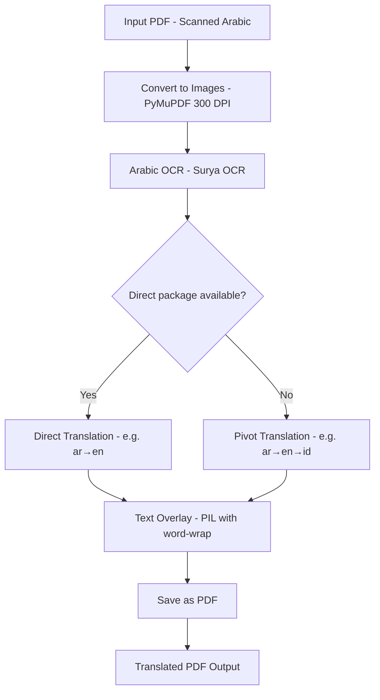

<div align="center">
  
</div>

# Tarjim: PDF Arabic OCR & Translator

End-to-end pipeline to **extract Arabic text from scanned PDF**, **translate it**, and **generate a new translated PDF** — fully offline using open-source tools.

Built for translating Arabic Islamic scholarly texts (kitab) to English and Indonesian, but supports any language pair available in Argos Translate. Automatically routes through English when direct translation isn't available (e.g., Arabic → English → Indonesian).

---

## Overview

Tarjim automates the process of handling Arabic documents by integrating:

1. **PDF rendering** — PyMuPDF converts PDF pages to high-resolution images
2. **Arabic OCR** — Surya OCR detects and recognizes Arabic text with bounding boxes
3. **Offline translation** — Argos Translate provides fully offline translation with smart routing (direct ar→en, or pivot ar→en→id for Indonesian)
4. **Text overlay** — Translated text replaces original Arabic on the PDF with proper font sizing and word-wrapping
5. **PDF generation** — Modified pages are saved as a new translated PDF

Designed for researchers, students, and anyone who needs an **offline, private, and flexible** document translation pipeline.

---

## Features

- Extract text from scanned or non-searchable Arabic PDFs (OCR)
- Translate to **English** (direct) or **Indonesian** (pivot via English), plus many other languages
- Smart translation routing: uses direct packages when available, automatically pivots through English otherwise
- Replace Arabic text with translated text directly on the PDF pages
- Fully offline — no API keys, no internet required after setup
- Two overlay modes: **replace** (overlay on original) or **clean** (white background)
- Modular Python code (OCR / translation / overlay / PDF handling separated)
- Web UI via FastAPI for browser-based usage
- CLI for batch/scripted processing
- Docker support for easy deployment

---

## Pipeline Architecture



## Tech Stack

| Component | Library | Purpose |
|-----------|---------|---------|
| PDF handling | PyMuPDF | Read/write PDF, render pages to images |
| OCR | Surya OCR | Arabic text detection + recognition |
| Translation | Argos Translate | Offline machine translation |
| Image processing | Pillow, OpenCV | Image manipulation, text overlay |
| Web API | FastAPI + Uvicorn | Browser-based upload/translate UI |
| Progress | tqdm | Progress bars for CLI |

## Installation

```bash
# Clone the repo
git clone https://github.com/scrowten/tarjim.git
cd tarjim

# Create environment
python -m venv venv
source venv/bin/activate  # or venv\Scripts\activate (Windows)

# Install dependencies
pip install -r requirements.txt
```

### First-run setup

On first run, Surya OCR models (~2-3 GB) and Argos translation packages will be downloaded automatically. After that, everything runs fully offline.

To pre-download Argos translation packages:

```python
from argostranslate import package
package.update_package_index()
available = package.get_available_packages()

# For Arabic → English (direct)
pkg = next(p for p in available if p.from_code == "ar" and p.to_code == "en")
package.install_from_path(pkg.download())

# For Arabic → Indonesian (pivot: ar → en → id)
pkg_en_id = next(p for p in available if p.from_code == "en" and p.to_code == "id")
package.install_from_path(pkg_en_id.download())
```

---

## Usage

### CLI

```bash
# Arabic to English (direct translation)
python -m src.cli --input kitab.pdf --output kitab_en.pdf --lang en

# Arabic to Indonesian (auto-pivots via English: ar → en → id)
python -m src.cli --input kitab.pdf --output kitab_id.pdf --lang id

# With all options
python -m src.cli --input kitab.pdf --output kitab_en.pdf --lang en --overlay-mode replace --dpi 300

# Clean mode (white background, translated text only)
python -m src.cli --input kitab.pdf --output kitab_en.pdf --overlay-mode clean

# Verbose logging (shows translation route)
python -m src.cli --input kitab.pdf --output kitab_id.pdf --lang id --verbose
```

### CLI Options

| Option | Default | Description |
|--------|---------|-------------|
| `--input`, `-i` | (required) | Path to input Arabic PDF |
| `--output`, `-o` | (required) | Path to save translated PDF |
| `--lang`, `-l` | `en` | Target language code |
| `--source-lang` | `ar` | Source language code |
| `--dpi` | `300` | Rendering DPI |
| `--overlay-mode` | `replace` | `replace` or `clean` |
| `--font` | (auto) | Path to .ttf font file |
| `--verbose`, `-v` | off | Enable debug logging |

### Web API

```bash
# Start the web server
uvicorn src.api:app --host 0.0.0.0 --port 8000

# Open http://localhost:8000 in your browser
```

### Docker

```bash
docker build -t tarjim .
docker run -p 8000:8000 tarjim
```

### Python API

```python
from src.core.pdf_handler import process_pdf

# Arabic to English (direct)
process_pdf(
    input_path="kitab.pdf",
    output_path="kitab_en.pdf",
    target_lang="en",
    overlay_mode="replace",
)

# Arabic to Indonesian (auto-pivots via English)
process_pdf(
    input_path="kitab.pdf",
    output_path="kitab_id.pdf",
    target_lang="id",
    overlay_mode="replace",
)
```

---

## Translation Routing

Tarjim automatically determines the best translation route for your target language:

| Target | Route | How it works |
|--------|-------|-------------|
| English (`en`) | Direct | ar → en |
| Indonesian (`id`) | Pivot | ar → en → id |
| Malay (`ms`) | Pivot | ar → en → ms |
| French (`fr`) | Pivot | ar → en → fr |
| German (`de`) | Pivot | ar → en → de |
| Spanish (`es`) | Pivot | ar → en → es |
| Turkish (`tr`) | Pivot | ar → en → tr |

**Direct translation** uses a single Argos package (e.g., `ar→en`). This is faster and generally more accurate.

**Pivot translation** chains two packages (e.g., `ar→en` + `en→id`). This is used when no direct Arabic→target package exists. The system detects this automatically — you just set `--lang id` and it handles the rest.

Use `--verbose` in the CLI to see which route is being used.

---

## How It Works

**Step 1 — PDF to Images**: Each PDF page is rendered at 300 DPI using PyMuPDF, producing high-resolution PIL Images suitable for OCR.

**Step 2 — OCR with Surya**: Surya OCR detects text regions and recognizes Arabic text, returning text lines with precise bounding boxes (x1, y1, x2, y2).

**Step 3 — Translation with Argos**: Each detected text line is translated using Argos Translate (fully offline). For English, this is a direct translation. For Indonesian and other languages, the system automatically pivots through English (ar → en → target) when no direct package exists.

**Step 4 — Text Overlay**: In "replace" mode, each original text region is covered with a white rectangle, then the translated text is drawn in its place with dynamically-sized fonts and word-wrapping. In "clean" mode, a fresh white page is used.

**Step 5 — Save PDF**: All modified page images are combined into a new multi-page PDF.

---

## Folder Structure

```
tarjim/
├── README.md
├── requirements.txt
├── Dockerfile
├── __init__.py
├── src/
│   ├── __init__.py
│   ├── cli.py                      # CLI entry point
│   ├── api.py                      # FastAPI web server
│   └── core/
│       ├── __init__.py
│       ├── pdf_handler.py          # Pipeline orchestrator + PDF I/O
│       ├── ocr_surya.py            # Surya OCR wrapper
│       ├── translator_argos.py     # Argos Translate wrapper
│       ├── utils.py                # Overlay, font, drawing helpers
│       ├── image_processor.py      # Image preprocessing (legacy)
│       ├── ocr.py                  # Tesseract OCR (legacy fallback)
│       └── translate.py            # Online translation (legacy fallback)
├── static/
│   ├── index.html                  # Web UI
│   └── styles.css
├── fonts/
│   └── times.ttf                   # Bundled font
├── examples/
│   ├── al-qawaid-al-arba.pdf      # Sample Arabic kitab
│   └── ifadatul-mustafid-1-page.pdf
├── notebooks/                      # Jupyter exploration notebooks
├── tests/
│   ├── conftest.py
│   ├── test_pdf_handler.py
│   ├── test_utils.py
│   └── test_translator_argos.py
└── docs/
    ├── logo.png
    └── usage.md
```

---

## Performance Notes

- **First run**: Surya models (~2-3 GB) download on first use. After that, fully offline.
- **Per-page time**: ~5-10 seconds (depends on page complexity and hardware).
- **GPU acceleration**: Surya leverages CUDA if available for faster OCR.
- **Memory**: ~4-6 GB with models loaded.
- **DPI tradeoff**: Higher DPI = better OCR accuracy but slower processing. 300 DPI is recommended.

---

## Possible Extensions

- Batch processing (translate entire folders of PDFs)
- Side-by-side bilingual PDF output
- Automatic language detection
- Integration with cloud translation APIs (optional, for higher quality)
- Layout-aware translation (tables, columns, headers)
- Translation confidence scoring

---

## Author

Risky Agung Dwi Putranto

## License

MIT License — free to use, modify, and share.

## Acknowledgements

- [Surya OCR](https://github.com/VikParuchuri/surya) — State-of-the-art document OCR
- [Argos Translate](https://github.com/argosopentech/argos-translate) — Open-source offline translation
- [PyMuPDF](https://github.com/pymupdf/PyMuPDF) — PDF rendering and manipulation
- [Pillow](https://github.com/python-pillow/Pillow) — Image processing
