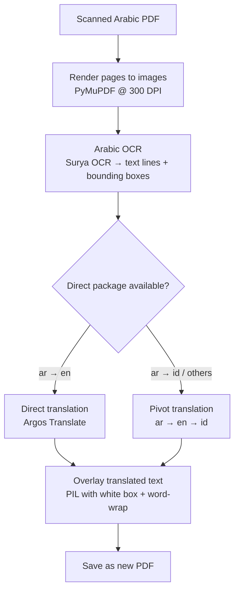

## Why I Built This

I wanted to read kitab — classical Arabic Islamic scholarly texts — but I don't read Arabic fluently enough to get through them on my own. These books carry centuries of knowledge: fiqh, aqeedah, tafsir, hadith commentary. Scholars have written in Arabic for over a millennium, and most of that wisdom has never been fully translated into Indonesian or English.

My copy of *Al-Qawa'id Al-Arba'* by Imam Muhammad ibn Abd al-Wahhab sits as a scanned PDF. So does *Ifadatul Mustafid*. Most of the kitab I've collected are scanned images — not searchable text, just photographs of old book pages.

The existing options were frustrating:
- **Google Translate** works on typed text, not on scanned PDFs
- **Commercial tools** either require internet, cost money, or don't handle Arabic well
- **Copying text** from a scanned PDF is impossible — it's just pixels

So I built **Tarjim** (تَرجِم — Arabic for "translate").

---

## What Tarjim Does

Tarjim takes a scanned Arabic PDF, runs OCR to extract the text line by line, translates each line offline, and writes the translated text back onto the same PDF — replacing the original Arabic in-place.

The result is a new PDF that looks like the original layout, but in English (or Indonesian, or other languages).

```
Input:  Scanned Arabic PDF  (just images of Arabic text)
            ↓
Output: Translated PDF  (English/Indonesian text in the same positions)
```

The entire pipeline runs **offline** after the initial model download. No API keys. No internet. No data leaves your machine. This was a hard requirement for me — these are religious texts, and privacy matters.

---

## How It Works

The pipeline has five steps:



### Step 1 — Render PDF to Images

Since the input is a scanned document (images, not text), we first render each page into a high-resolution PIL image using PyMuPDF at 300 DPI. Higher DPI means better OCR accuracy.

```python
zoom = 300 / 72.0  # PDF baseline is 72 DPI
matrix = pymupdf.Matrix(zoom, zoom)
pix = page.get_pixmap(matrix=matrix)
image = Image.frombytes("RGB", (pix.width, pix.height), pix.samples)
```

### Step 2 — OCR with Surya

This is the most critical step. I tried three OCR engines before settling on Surya:

- **Tesseract** — The classic. Arabic support exists, but accuracy on old scanned texts is poor. Struggles with naskh and ruq'ah scripts.
- **PaddleOCR** — Better accuracy, but heavier setup and the Arabic model needed extra configuration.
- **Surya OCR** — Built specifically for document-level OCR, supports Arabic out of the box, and returns text lines with precise bounding boxes. This is what I use.

Surya returns a structured prediction: for each page, you get a list of `text_lines`, each with `.text` (the recognized Arabic string) and `.bbox` (the pixel coordinates `x1, y1, x2, y2`).

```python
from surya.recognition import RecognitionPredictor
from surya.detection import DetectionPredictor

recognition_predictor = RecognitionPredictor(foundation_predictor)
detection_predictor = DetectionPredictor()

predictions = recognition_predictor([image], det_predictor=detection_predictor)
page = predictions[0]

for line in page.text_lines:
    print(line.text)   # "بِسْمِ اللَّهِ الرَّحْمَنِ الرَّحِيمِ"
    print(line.bbox)   # (42, 120, 890, 158)
```

### Step 3 — Translate with Argos Translate

Argos Translate is a fully offline, open-source machine translation library backed by OpenNMT models. Once packages are downloaded, no network is needed.

The interesting engineering problem here was supporting Indonesian (Bahasa Indonesia) — there is no direct Arabic → Indonesian package in Argos. The solution: **pivot translation**.

I'll explain this in detail in the next section.

### Step 4 — Overlay Translated Text

For each detected text line, I:
1. Draw a **white rectangle** over the original Arabic text (covering it completely)
2. Calculate an appropriate font size based on the bounding box height
3. Draw the translated text with **word-wrapping** to fit inside the same bounding box

```python
# Cover the original Arabic
draw.rectangle([x1, y1, x2, y2], fill="white", outline="white")

# Calculate font size from bbox height
font_size = max(1, int((y2 - y1) * 0.8))
font = ImageFont.truetype(font_path, font_size)

# Word-wrap and draw translated text
draw_text_in_box(draw, translated_text, bbox, font)
```

There's also a `clean` mode that starts from a blank white page — useful if you just want the translated text without the original scanned image behind it.

### Step 5 — Save as PDF

All modified page images are saved back into a multi-page PDF using Pillow.

---

## The Engineering Decision I'm Most Proud Of: Smart Translation Routing

This was the most interesting design challenge.

Argos Translate has language packages that you install individually — `ar→en`, `en→id`, `en→fr`, etc. There is an `ar→en` package (Arabic to English). But there is **no** `ar→id` package (Arabic to Indonesian).

So how do you translate Arabic to Indonesian? You chain two translations:

```
Arabic text → [ar→en model] → English text → [en→id model] → Indonesian text
```

This is called **pivot translation through English**.

The challenge is making this seamless. A user just wants to say `--lang id` and get Indonesian output. They shouldn't need to know about pivoting.

Here's how I implemented it:

```python
def setup_argos_translation(from_code: str, to_code: str) -> str:
    """
    Returns 'direct' or 'pivot:en' depending on available packages.
    Auto-installs whatever is needed.
    """
    # 1. Try to find a direct package (e.g., ar→id)
    direct_package = find_package(from_code, to_code)
    if direct_package:
        install(direct_package)
        return "direct"

    # 2. No direct package — install pivot packages (ar→en + en→id)
    install(find_package(from_code, "en"))
    install(find_package("en", to_code))
    return "pivot:en"
```

And in `translate_text()`, if the pair is known to be a pivot pair, it chains two calls:

```python
def translate_text(text, from_code="ar", to_code="id"):
    if "ar->id" in _PIVOT_PAIRS:
        # Two-step: ar → en → id
        en_text = argos.translate(text, "ar", "en")
        return argos.translate(en_text, "en", "id")

    # Direct: ar → en
    return argos.translate(text, from_code, to_code)
```

The system remembers which pairs need pivoting at runtime. It even **auto-discovers** the need: if a direct translation call fails, it automatically retries via the English pivot and marks that pair for future calls.

The route selection is fully transparent through the CLI:

```
$ python -m src.cli -i kitab.pdf -o kitab_id.pdf --lang id --verbose

Translation route: ar → en → id (pivot through English, no direct package available)
```

### Translation Routing Table

| Target Language | Route | Packages Needed |
|----------------|-------|----------------|
| English (`en`) | Direct | `ar→en` |
| Indonesian (`id`) | Pivot | `ar→en` + `en→id` |
| Malay (`ms`) | Pivot | `ar→en` + `en→ms` |
| French (`fr`) | Pivot | `ar→en` + `en→fr` |
| German (`de`) | Pivot | `ar→en` + `en→de` |
| Spanish (`es`) | Pivot | `ar→en` + `en→es` |
| Turkish (`tr`) | Pivot | `ar→en` + `en→tr` |

---

## Getting Started

### Installation

```bash
git clone https://github.com/scrowten/tarjim.git
cd tarjim

python -m venv venv
source venv/bin/activate  # Windows: venv\Scripts\activate

pip install -r requirements.txt
```

On first run, Surya OCR models (~2–3 GB) and Argos translation packages download automatically. After that: fully offline.

### Translate Arabic → English

```bash
python -m src.cli --input kitab.pdf --output kitab_en.pdf --lang en
```

### Translate Arabic → Indonesian

```bash
python -m src.cli --input kitab.pdf --output kitab_id.pdf --lang id
```

The system automatically uses the ar→en→id pivot route. You don't need to do anything special.

### Web UI

```bash
uvicorn src.api:app --port 8000
# Open http://localhost:8000
```

Upload a PDF, pick a language, click Translate. The UI shows the translation route so you know what's happening under the hood.

### Docker

```bash
docker build -t tarjim .
docker run -p 8000:8000 tarjim
```

The Docker image pre-downloads both the `ar→en` and `en→id` packages at build time.

### Python API

```python
from src.core.pdf_handler import process_pdf

# Arabic → Indonesian
process_pdf(
    input_path="al-qawaid-al-arba.pdf",
    output_path="al-qawaid-al-arba_id.pdf",
    target_lang="id",
    overlay_mode="replace",  # or "clean" for white background
)
```

---

## Project Structure

```
tarjim/
├── src/
│   ├── cli.py                    # Command-line interface
│   ├── api.py                    # FastAPI web server
│   └── core/
│       ├── pdf_handler.py        # Pipeline orchestrator
│       ├── ocr_surya.py          # Surya OCR wrapper
│       ├── translator_argos.py   # Argos Translate + pivot routing
│       └── utils.py              # Text overlay, fonts, word-wrap
├── static/
│   ├── index.html                # Web UI
│   └── styles.css
├── tests/                        # Unit tests
├── Dockerfile
└── requirements.txt
```

The core modules are intentionally small and single-purpose. `translator_argos.py` knows nothing about PDFs. `ocr_surya.py` knows nothing about translation. `pdf_handler.py` orchestrates everything.

---

## Challenges & Lessons Learned

**OCR accuracy on old texts is hard.** Surya is the best open-source option available, but classical Arabic manuscript fonts are different from modern typeset text. Vowel diacritics (*tashkeel*) especially trip up OCR models. For perfectly clean modern typeset kitab, results are good. For old handwritten manuscripts, there's room to improve.

**Translation quality through pivoting is lossy.** Chaining `ar→en→id` means any error in the first step gets propagated and amplified in the second. The `ar→en` Argos model performs reasonably well on straightforward prose, but classical Arabic religious vocabulary — *tawhid*, *shirk*, *sunnah*, *bid'ah* — often gets transliterated rather than translated, which is actually appropriate for Islamic texts.

**Font fitting is a solved problem — just tedious.** Getting English text to fit into the same bounding box as Arabic text is fiddly. Arabic is compact horizontally; English words for the same concept are often longer. I handle this with dynamic font sizing and word-wrapping, but very dense Arabic pages still get tight.

**Lazy imports matter for usability.** Early versions of the code eagerly imported PyMuPDF and Surya at the top of every file. This meant that even `import src.core.utils` would try to load multi-gigabyte models. Moving to lazy imports (`__getattr__` on the package `__init__.py`) made the module usable in testing environments without all dependencies present.

---

## What's Next

The project is functional but there's a clear path forward:

- **Better handling of dense pages** — Auto-shrink font, or flow overflow text to margins
- **Bilingual output mode** — Show original Arabic alongside the translation (side-by-side columns or interleaved pages)
- **Batch processing** — Translate an entire folder of kitab PDFs in one command
- **Confidence scoring** — Flag lines where OCR or translation confidence is low
- **Better support for tashkeel** — Strip or handle vowel diacritics before OCR to improve accuracy
- **Table of contents preservation** — Detect and translate structural elements, not just body text
- **Optional cloud API mode** — Hook into a higher-quality translation API (OpenAI, Google) for users who prefer accuracy over privacy

---

## Try It

The project is open source under MIT license.

**GitHub:** [github.com/scrowten/tarjim](https://github.com/scrowten/tarjim)

```bash
git clone https://github.com/scrowten/tarjim.git
pip install -r requirements.txt
python -m src.cli --input your_kitab.pdf --output translated.pdf --lang en
```

If you work with Arabic documents — religious texts, academic papers, historical archives — I hope this tool is useful to you. Contributions, issues, and suggestions are very welcome.

---

*Built with [Surya OCR](https://github.com/VikParuchuri/surya), [Argos Translate](https://github.com/argosopentech/argos-translate), [PyMuPDF](https://github.com/pymupdf/PyMuPDF), and [FastAPI](https://fastapi.tiangolo.com/).*
